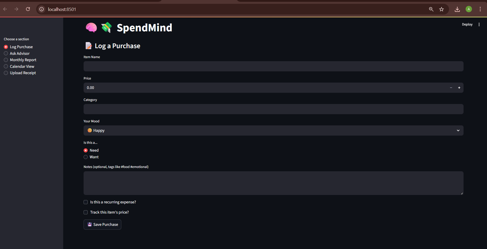
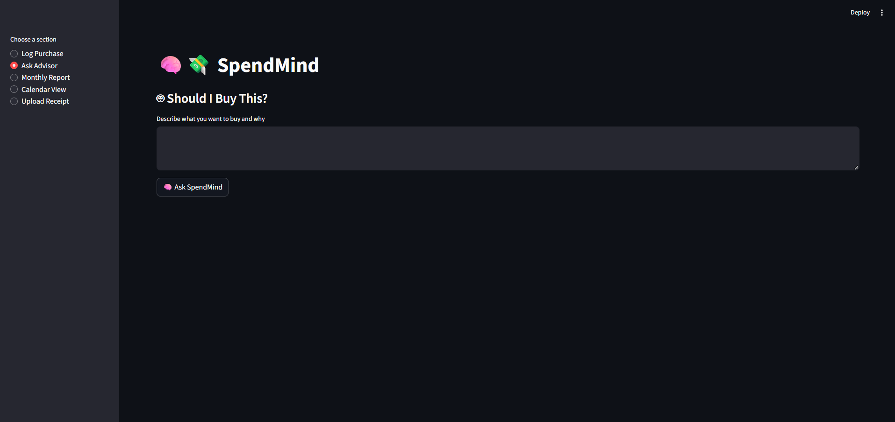
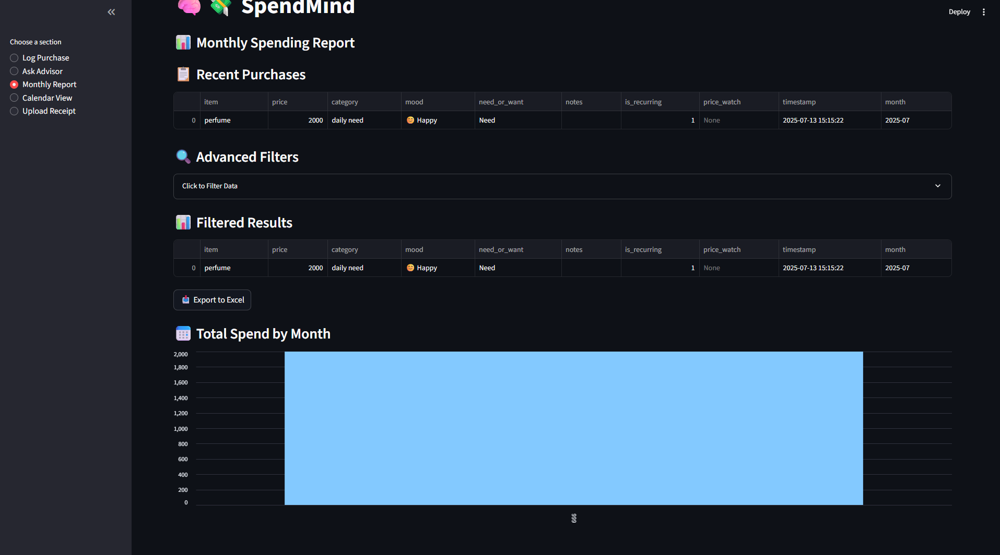

# 🧠💸 SpendMind - Your AI Spending Advisor

SpendMind is a smart, personal finance assistant powered by AI. Track your expenses, get personalized buying advice, set budgets, upload receipts, and more — all in a clean, Streamlit-powered web interface.

---

## ✨ Features

### 🔍 Smart Expense Logging
- Log purchases with category, mood, and need/want flags
- Tag purchases with notes (e.g., #food, #gadget)
- Recurring expense and price-watch support

### 📊 Monthly Reports
- Visual analytics (bar charts, filters, summaries)
- Category-wise breakdown
- Mood-wise spending behavior
- Export filtered data to Excel

### 🧠 Ask the AI
- Describe what you want to buy and get smart advice
- AI uses past spending patterns + mood to help you decide

### 🔔 Warnings & Reminders
- Spending limit alerts (per category)
- Upcoming recurring bill reminders
- Price drop alerts for tracked items

### 🧾 Receipt OCR
- Upload a receipt image
- Automatically extract text using Tesseract OCR

### 📅 Calendar View
- Timeline of spending activity per day

---

## ✨ Features Overview (with Screenshots)

---

### 🔍 Log a Purchase
Track your spending with item, price, mood, need/want tag, and optional notes.



---

### 🧠 Ask Advisor
Get AI-based advice before making impulsive purchases.


---

### 📊 Monthly Spending Report
Visualize purchases with filters and monthly summaries.



---


### 🧾 Receipt Upload
Upload and scan receipts using OCR.


---

## 📈 Extra Feature: Export to Excel
Export your filtered monthly data.


## 📦 Technologies Used

- [Streamlit](https://streamlit.io/)
- [LangChain + Gemini](https://ai.google.dev/)
- [SQLite](https://www.sqlite.org/)
- [Pandas](https://pandas.pydata.org/)
- [Tesseract OCR](https://github.com/tesseract-ocr/tesseract)
- Python 3.8+

---

## 🚀 Getting Started

### 1. Clone the Repo

```bash
git clone https://github.com/deepalisachan04/spendmind.git
cd spendmind
```

### 2. Install Requirements

```bash
pip install -r requirements.txt
```

### 3. Install Tesseract OCR

#### On Ubuntu/Debian
```bash
sudo apt update && sudo apt install tesseract-ocr
```

#### On macOS
```bash
brew install tesseract
```

#### On Windows
- Download from: https://github.com/tesseract-ocr/tesseract

---

### 4. Set Up API Key

1. Copy the `.env.example` file to `.env`
2. Add your Google Gemini API Key:

```
GOOGLE_API_KEY=your_api_key_here
```

---

### 5. Run the App

```bash
streamlit run app.py
```

---


## 🛡 Security Note

- Do NOT commit your `.env` file or API keys.
- Use `.gitignore` to exclude `*.env` and `*.db`

---

## 🙋‍♀️ Author

Made with 💙 by [Deepali Sachan](https://github.com/deepalisachan04)

---

## 📃 License
MIT 

Copyright (c) 2025 Deepali Sachan

Permission is hereby granted, free of charge, to any person obtaining a copy
of this software and associated documentation files (the "Software"), to deal
in the Software without restriction, including without limitation the rights
to use, copy, modify, merge, publish, distribute, sublicense, and/or sell
copies of the Software, and to permit persons to whom the Software is
furnished to do so, subject to the following conditions:

The above copyright notice and this permission notice shall be included in all
copies or substantial portions of the Software.

THE SOFTWARE IS PROVIDED "AS IS", WITHOUT WARRANTY OF ANY KIND, EXPRESS OR
IMPLIED, INCLUDING BUT NOT LIMITED TO THE WARRANTIES OF MERCHANTABILITY,
FITNESS FOR A PARTICULAR PURPOSE AND NONINFRINGEMENT. IN NO EVENT SHALL THE
AUTHORS OR COPYRIGHT HOLDERS BE LIABLE FOR ANY CLAIM, DAMAGES OR OTHER
LIABILITY, WHETHER IN AN ACTION OF CONTRACT, TORT OR OTHERWISE, ARISING FROM,
OUT OF OR IN CONNECTION WITH THE SOFTWARE OR THE USE OR OTHER DEALINGS IN THE
SOFTWARE.

